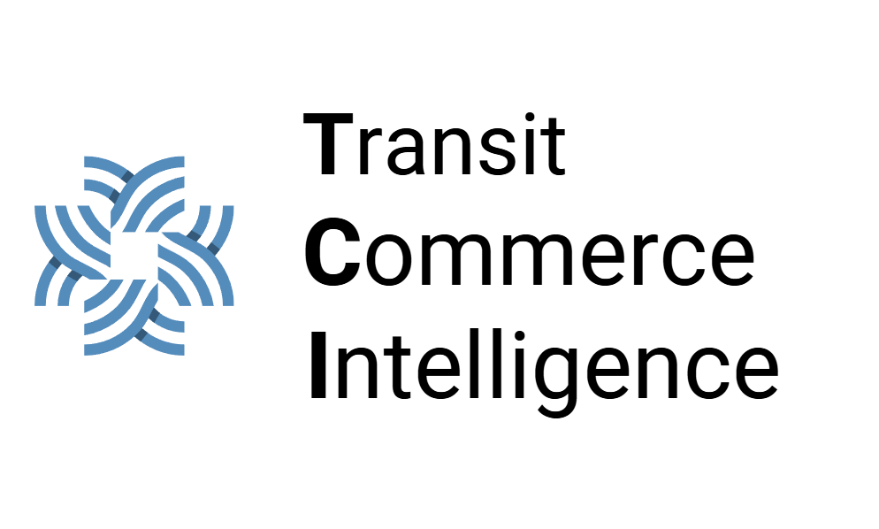

  

# TCI (Transit Commerce Intelligence)

An AI powered WebGIS platform for economic insight and property investment potential around mass transportation hubs in Indonesia. Built for the MAPID WebGIS Competition, Mass Transportation Edition, 2026.

## Table of Contents

1. Overview
2. Background and Problem Statement
3. Proposed Solution
4. Data Sources
5. Spatial Analysis Methods
6. AI Models
7. Features and Visualization Layers
8. System Architecture and Tech Stack
9. Team
10. Competition Context
11. Roadmap

## Overview

TCI (Transit Commerce Intelligence) is a WebGIS platform that translates transit activity data around KRL Commuter Line stations and other mass transit nodes into two complementary layers of insight. The Economic Layer identifies commercial hotspots for small and medium enterprises (UMKM) and marketers. The Property or TOD Layer scores and ranks stations by development potential for property developers and local governments. Both layers are derived from the same underlying activity data, so users no longer need to manually reconcile figures scattered across separate publications.

The platform combines spatial analysis techniques (hotspot analysis, scoring models, buffer and network analysis) with five AI models covering forecasting, clustering, regression, classification, and a large language model for narrative generation. Because the system treats station activity as a time series rather than a static snapshot, it captures growth trends, allowing stations with strong upward momentum to be prioritized even if their absolute passenger volume is not yet the highest.

## Background and Problem Statement

KRL Commuter Line ridership reached approximately 400.99 million passengers nationally in 2025, a 7.08 percent increase year over year, with average daily ridership in Jabodetabek reaching around 950 thousand passengers. This growth signals that stations have evolved beyond simple transit points into hubs of economic activity.

Despite this, the surrounding potential is underused. UMKM operators typically choose business locations based on intuition and simple field observation rather than data driven analysis of foot traffic patterns, area characteristics, or existing business density. Property developers and local governments face a parallel problem. Proximity to transit nodes is known to raise property values and commercial appeal, but not every station shares the same activity level, connectivity, or development potential. Passenger volume, property price, and area characteristic data are also fragmented across multiple sources with inconsistent coverage and update schedules, making stations difficult to compare directly.

TCI addresses this gap by integrating transportation activity data, area characteristics, spatial analysis, and AI driven prediction into a single decision support system, targeting the Business and Government elements of the Penta Helix framework, with secondary relevance to Academic, Community, and Media stakeholders.

## Proposed Solution

TCI answers two related but distinct needs from the same root dataset.

UMKM operators and marketers need to know which points near a station have high selling or marketing potential, supported by data on existing business types, crowd levels, activity patterns, and open market opportunities.

Property developers and local governments need a way to evaluate each station based on real activity rather than assumption, in order to prioritize development in line with the growing role of Transit Oriented Development (TOD).

TCI reads activity and economic potential around each transit node and produces two layers of output.

Economic Layer: a hotspot map of selling and marketing potential, calculated from transaction density, existing business types, and peak hour patterns, intended for UMKM and marketing teams.

Property or TOD Layer: a station score and ranking of development potential, calculated from passenger volume, intermodal integration, and land availability, intended for developers and government planners.

## Data Sources

| Data | Source | Purpose | Visualization |
|---|---|---|---|
| Community activity (Menu Go, Struk Go) | MAPID Apps, Community Maps, Mission Data | Transaction density and business type near stations | Economic hotspot heatmap |
| Property Go | MAPID Apps | Property and land data near stations | Land potential polygon layer |
| Passenger volume and station network | KAI Commuter official data, cross checked with public sources | Station activity ranking | Proportional symbols or choropleth per station |
| Field survey | MAPID Apps survey activity | Field validation and enrichment, mandatory for curated teams | Photo or observation points |
| Administrative boundaries, POI, road network | Badan Informasi Geospasial (BIG) | Area context | Supplementary layer |

### Preprocessing Pipeline

Cleaning: removal of duplicate or invalid entries in transaction and survey data, coordinate format standardization, and interpolation of missing monthly passenger volume values.

Standardization: aligning time units (daily and monthly aggregation), coordinate reference systems (a single consistent CRS, for example EPSG 4326 or UTM), and station naming conventions across datasets (KAI Commuter versus MAPID Apps) to enable joins on a shared key.

Enrichment: combining station activity data with supporting attributes such as distance to POI, road network density, and administrative boundaries at the kelurahan or kecamatan level, giving each point richer contextual features for modeling.

Validation: comparing aggregated figures against official public sources (KAI Commuter, BPS) as a sanity check, and verifying model outputs against MAPID Apps field survey data as ground truth.

## Spatial Analysis Methods

Hotspot Analysis (Kernel Density Estimation or Getis Ord Gi*): maps the density of economic activity around each station. This method is designed to identify statistically significant point clusters, matching the point based transaction nature of the Economic Layer.

Scoring and Ranking Model: combines weighted passenger volume, business density, and land availability, inspired by the Hedonic Pricing Model as applied in academic studies of Indonesian station property relationships. This approach was chosen because the Property or TOD Layer requires relative comparison across many stations rather than absolute price prediction.

Buffer and Network Analysis: calculates walkable catchment radius from each station, typically studied between 500 meters and 1 kilometer in Indonesian TOD literature. Network based walking distance is used rather than straight line (euclidean) distance, consistent with TOD accessibility literature.

## AI Models

| Model | Type | Input | Function | Output |
|---|---|---|---|---|
| Time Series Forecasting (Prophet, ARIMA, or a simple LSTM) | Predictive | Historical monthly passenger volume | Projects passenger volume 3 to 6 months ahead per station | Station activity trend projection |
| Clustering (K Means or DBSCAN) | Unsupervised | Passenger volume, existing business density, intermodal integration level, and enrichment attributes (POI distance, road network density, administrative boundary) | Groups stations into area typologies, for example high growth transit hub, stable residential node, underutilized potential | Station typology map |
| Regression (Multiple Linear Regression or Random Forest Regressor) | Predictive | Distance to station, passenger volume, business density, land availability | Computes an investment potential score per station, inspired by the Hedonic Pricing Model | Score from 0 to 100 and station ranking |
| Classification (Decision Tree or Random Forest Classifier) | Predictive | Menu Go and Struk Go transaction data per location, plus nearby POI presence (for example minimarket, retail) as a supplementary signal where digital transaction data is sparse | Recommends the most suitable business type (F&B, retail, service) per point | Business type recommendation |
| LLM API (Gemini) | Generative | Combined output of the four models above, plus user queries | Summarizes output into narrative form when a user selects a point or station | Narrative insight and interactive answers |

### Validation Approach

Every model is validated against MAPID Apps field survey data as ground truth, checking for example whether stations with a high activity score actually show high business density in the field. Evaluation metrics include MAE and RMSE for forecasting and regression models, and Accuracy and F1 score for the classification model. Initial validation results will be reported once model development and testing are complete.

## Features and Visualization Layers

The WebGIS presents four primary layers: Economic Layer (hotspot heatmap), Property or TOD Layer (investment score polygon), Station Typology Layer (clustering result), and Field Survey Layer (validation points).

| Feature | Function | Target User |
|---|---|---|
| Hotspot Finder | Interactive heatmap of selling potential by business type | UMKM, marketers |
| Station Investment Score | Score from 0 to 100 per station with ranking, clickable breakdown of the reasoning behind each score | Developers, government |
| Trend Dashboard | Historical passenger volume chart combined with forecasting results | Developers, government, KAI |
| Station Typology Map | Clustering result visualized as distinct color coded layers | Developers, government |
| Survey Data Layer | Field photo and observation points as a validation layer | Internal team, government |
| Radius or Buffer Analyzer | Adjustable radius slider from 500 meters to 1 kilometer with live hotspot and score updates | UMKM, developers |
| Popup | Detailed information on any point or polygon | All users |
| Filter and Search | Filters results by business category, score range, and other criteria | UMKM, developers, government |
| AI Insight Panel | Recommends the most suitable business type for a location and explains the quantitative reasoning behind each station investment score using an LLM generated narrative | All users |
| Smart Query | Natural language search with map highlighting in the response | All users |

## System Architecture and Tech Stack

| Component | Plan |
|---|---|
| Frontend / WebGIS | React with TypeScript, using Leaflet.js or MapLibre GL JS, and Turf.js for lightweight client side spatial analysis |
| Backend | Node.js with Express.js |
| Geospatial Database | PostgreSQL with PostGIS, hosted via Supabase |
| Data Management Platform | GEO MAPID |
| Spatial Analysis | QGIS, Google Earth Engine, PostGIS, and Python or R geospatial libraries (ArcGIS is not permitted per competition rules) |
| AI | Time series forecasting (Prophet or ARIMA), clustering (K Means or DBSCAN), regression (Random Forest), classification (Decision Tree or Random Forest), and Gemini LLM API for narrative insight generation |
| Deployment | Vercel, using the free tier domain and hosting |

All components rely on open source or freely available tooling, in line with the competition requirement to avoid licensed GIS software during the analysis stage.

## Team

| Name | MAPID Apps Username |
|---|---|
| Abraham Gregorius Anderson Thio | grgsxx |
| Axel Sanjiro Yang | axel |
| Jason Brandon Loi | bloi |
| Stanislaus Alva Jufinto | stnslv |
| Vallerie Anne Jose | annejosss |

### Team Capability Summary

Frontend: React with TypeScript for the interactive WebGIS interface, Leaflet.js and MapLibre GL JS for map rendering and spatial visualization, and Turf.js for client side spatial operations such as buffer, distance, and geometry overlay calculations.

Backend: JavaScript (Node.js) with Express.js for REST API development, authentication management, and communication between the frontend and the geospatial database.

Database: PostgreSQL with the PostGIS extension for storing and managing vector data (points, polygons, and lines), hosted on Supabase as a managed PostgreSQL instance with PostGIS enabled, supporting complex real time spatial queries.

## Competition Context

This project targets the MAPID WebGIS Competition, Mass Transportation Edition, 2026, a national competition themed around transforming mass transportation ecosystem data into an AI powered WebGIS ("Maps That Think").

Registration period: June 24 to August 2, 2026, free of charge, national scope.

Total prize pool: Rp 30,000,000, split across First Place (Rp 12,000,000), Second Place (Rp 9,000,000), Third Place (Rp 6,000,000), and People's Choice (Rp 3,000,000). All winners also receive an official certificate, showcase placement, WebGIS publication, and networking access with MAPID stakeholders.

### Timeline

1. June 24 to August 2, 2026: Administrative registration and proposal submission
2. August 5, 2026: Top 50 announcement, granting dataset access, survey budget, and mentoring
3. August 7 to September 14, 2026: WebGIS development phase, including field survey, data processing, AI integration, PRD drafting, and finalization, with parallel mentoring
4. September 14, 2026: Final submission (public WebGIS link, final PRD, metadata, and survey documentation)
5. September 18, 2026: Top 10 announcement
6. September 23, 2026: Final round and showcase at MAPID Catalyst 2026

### Judging Criteria

1. Quality of insight, not just raw data
2. Quality of analysis and AI, logical, explainable, and verifiable
3. Relevance of the idea to the competition theme
4. Interactivity of the WebGIS (zoom, click, filter, layer control, search, attribute access)
5. Storytelling and narrative quality
6. Design and user experience, responsive across desktop and mobile with reasonable load times
7. Publication readiness, stable and publicly accessible
8. Implementation potential

## Roadmap

Phase 1: Finalize proposal and submit registration materials (complete)

Phase 2: If selected into the Top 50, gain access to curated dataset, survey budget, and GEO MAPID license, then begin the field survey and data collection process

Phase 3: Build the preprocessing pipeline (cleaning, standardization, enrichment, validation) and implement the spatial analysis layer (hotspot analysis, scoring model, buffer and network analysis)

Phase 4: Train and validate the five AI models against field survey ground truth

Phase 5: Build the WebGIS frontend and backend, integrate all layers and AI outputs, and deploy a public instance via Vercel

Phase 6: Prepare final submission (PRD, metadata, survey documentation) and prepare for the Top 10 showcase presentation

## License

Project documentation and analysis are intended for the MAPID WebGIS Competition, Mass Transportation Edition, 2026. Raw MAPID data must not be redistributed outside the competition per competition data terms.
